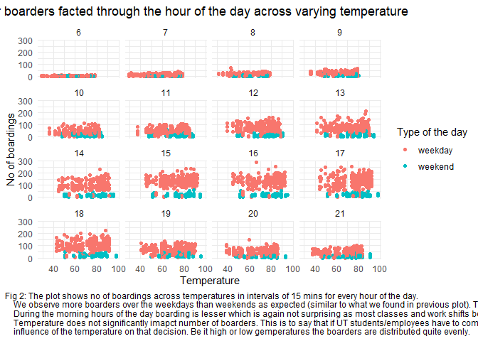

## Problem 1: visualization

## Problem 2: Saratoga house prices

<table>
<thead>
<tr class="header">
<th style="text-align: left;"></th>
<th style="text-align: right;">Model</th>
</tr>
</thead>
<tbody>
<tr class="odd">
<td style="text-align: left;">Medium Model</td>
<td style="text-align: right;">65766.89</td>
</tr>
<tr class="even">
<td style="text-align: left;">Linear Model</td>
<td style="text-align: right;">59530.19</td>
</tr>
<tr class="odd">
<td style="text-align: left;">KNN Model</td>
<td style="text-align: right;">61407.95</td>
</tr>
</tbody>
</table>

Summary of the linear regression model is:

    ## 
    ## Call:
    ## lm(formula = price ~ . - pctCollege - sewer - waterfront - newConstruction, 
    ##     data = ., use.all = FALSE)
    ## 
    ## Residuals:
    ##     Min      1Q  Median      3Q     Max 
    ## -226860  -35774   -5577   27838  453834 
    ## 
    ## Coefficients:
    ##                        Estimate Std. Error t value Pr(>|t|)    
    ## (Intercept)            221000.4     2785.8  79.332  < 2e-16 ***
    ## lotSize                  5233.1     1557.0   3.361 0.000795 ***
    ## age                     -1954.4     1790.8  -1.091 0.275274    
    ## landValue               32287.4     1692.5  19.077  < 2e-16 ***
    ## livingArea              42010.6     3013.5  13.941  < 2e-16 ***
    ## bedrooms                -7611.9     2206.6  -3.450 0.000576 ***
    ## fireplaces                978.8     1735.3   0.564 0.572796    
    ## bathrooms               15576.4     2344.2   6.645 4.13e-11 ***
    ## rooms                    6488.2     2368.1   2.740 0.006214 ** 
    ## heatinghot water/steam  -9219.3     4422.2  -2.085 0.037247 *  
    ## heatingelectric         -1476.5    13300.8  -0.111 0.911624    
    ## fuelelectric            -7647.6    13077.8  -0.585 0.558779    
    ## fueloil                  5062.0     5057.8   1.001 0.317060    
    ## centralAirNo           -10035.4     3629.3  -2.765 0.005755 ** 
    ## ---
    ## Signif. codes:  0 '***' 0.001 '**' 0.01 '*' 0.05 '.' 0.1 ' ' 1
    ## 
    ## Residual standard error: 60230 on 1627 degrees of freedom
    ## Multiple R-squared:  0.6305, Adjusted R-squared:  0.6276 
    ## F-statistic: 213.6 on 13 and 1627 DF,  p-value: < 2.2e-16

Linear model that considers all predictors except pctCollege, sewer,
waterfront, newConstruction. We have used stepwise regression in both
the direction to determine the appropriate set of variables to be
included. Performance of linear and KNN model is very close however, we
go ahead with the linear model. In the regression, fireplaces, age,
heatingelectric, fuelelectric and fueloil have become insignificant.
Lotsize, landvalue, livingarea, bedrooms and bathrooms turn out to be
highly significant in deterring the price. Overall, the model has a
decent value of R-squared of 62%. P-value is also quite low giving us
faith in the model.

## Problem 3: Classification and retrospective sampling

Summary of logit regression

    ##         (Intercept)            duration              amount         installment 
    ##               -0.63                0.03                0.00                0.24 
    ##                 age         historypoor     historyterrible          purposeedu 
    ##               -0.02               -1.45               -2.13                0.78 
    ## purposegoods/repair       purposenewcar      purposeusedcar       foreigngerman 
    ##                0.27                0.95               -0.84               -1.24

<table>
<thead>
<tr class="header">
<th style="text-align: left;"></th>
<th style="text-align: right;">predicted_no_default</th>
<th style="text-align: right;">predicted_default</th>
</tr>
</thead>
<tbody>
<tr class="odd">
<td style="text-align: left;">actual_no_default</td>
<td style="text-align: right;">158</td>
<td style="text-align: right;">22</td>
</tr>
<tr class="even">
<td style="text-align: left;">actual_default</td>
<td style="text-align: right;">49</td>
<td style="text-align: right;">21</td>
</tr>
</tbody>
</table>

Accuracy of the model based on confusion matrix is 71.6

As per this model having terrible or poor credit history implies that
probability of default will reduce when compared to having good credit
history which is not what we see in real world. The model predicts that
poor history multiplies the odds of defaulting on loans by 0.27 and
terrible credit history changes the odds by a factor of 0.13. However,
this is when compared to the odds of defaulting for someone with good
credit history. One would expect terrible credit history is have worse
impact than poor credit history however the model suggests otherwise.
Although model has 70.4% of accuracy this is undesirable behavior.
Therefore, we will need to make changes to the model. There is a risk of
wrongly classifying some poor creditors as terrible and vice versa. This
is perhaps due to sampling error induced while case controlling. Since
the dataset is biased towards having more defaulted loans which in real
world is rare. The dataset is heavily skewed towards poor (618) and
terrible (293) credit history folks.

## Problem 4: Children and hotel reservations

<table>
<thead>
<tr class="header">
<th style="text-align: left;"></th>
<th style="text-align: right;">Area under ROC Curves</th>
</tr>
</thead>
<tbody>
<tr class="odd">
<td style="text-align: left;">Baseline 1</td>
<td style="text-align: right;">0.6757539</td>
</tr>
<tr class="even">
<td style="text-align: left;">Baseline 2</td>
<td style="text-align: right;">0.8605945</td>
</tr>
<tr class="odd">
<td style="text-align: left;">Best Linear Model</td>
<td style="text-align: right;">0.8610736</td>
</tr>
<tr class="even">
<td style="text-align: left;">Stepwise linear Model</td>
<td style="text-align: right;">0.8496996</td>
</tr>
</tbody>
</table>

Baseline 2 (logit) is the best model

ROC curve for prediction on validation data across thresholds.
 Table
summarizing the expected (predicted whether the booking will be with a
child) and actual bookings in validation data using the baseline 2
model.

<table>
<thead>
<tr class="header">
<th style="text-align: left;"></th>
<th style="text-align: left;">Expected bookings</th>
<th style="text-align: left;">Actual bookings</th>
</tr>
</thead>
<tbody>
<tr class="odd">
<td style="text-align: left;">Fold01</td>
<td style="text-align: left;">21</td>
<td style="text-align: left;">16</td>
</tr>
<tr class="even">
<td style="text-align: left;">Fold02</td>
<td style="text-align: left;">19</td>
<td style="text-align: left;">23</td>
</tr>
<tr class="odd">
<td style="text-align: left;">Fold03</td>
<td style="text-align: left;">21</td>
<td style="text-align: left;">16</td>
</tr>
<tr class="even">
<td style="text-align: left;">Fold04</td>
<td style="text-align: left;">20</td>
<td style="text-align: left;">23</td>
</tr>
<tr class="odd">
<td style="text-align: left;">Fold05</td>
<td style="text-align: left;">22</td>
<td style="text-align: left;">20</td>
</tr>
<tr class="even">
<td style="text-align: left;">Fold06</td>
<td style="text-align: left;">19</td>
<td style="text-align: left;">17</td>
</tr>
<tr class="odd">
<td style="text-align: left;">Fold07</td>
<td style="text-align: left;">21</td>
<td style="text-align: left;">19</td>
</tr>
<tr class="even">
<td style="text-align: left;">Fold08</td>
<td style="text-align: left;">21</td>
<td style="text-align: left;">24</td>
</tr>
<tr class="odd">
<td style="text-align: left;">Fold09</td>
<td style="text-align: left;">21</td>
<td style="text-align: left;">26</td>
</tr>
<tr class="even">
<td style="text-align: left;">Fold10</td>
<td style="text-align: left;">19</td>
<td style="text-align: left;">19</td>
</tr>
<tr class="odd">
<td style="text-align: left;">Fold11</td>
<td style="text-align: left;">19</td>
<td style="text-align: left;">14</td>
</tr>
<tr class="even">
<td style="text-align: left;">Fold12</td>
<td style="text-align: left;">20</td>
<td style="text-align: left;">21</td>
</tr>
<tr class="odd">
<td style="text-align: left;">Fold13</td>
<td style="text-align: left;">23</td>
<td style="text-align: left;">16</td>
</tr>
<tr class="even">
<td style="text-align: left;">Fold14</td>
<td style="text-align: left;">25</td>
<td style="text-align: left;">29</td>
</tr>
<tr class="odd">
<td style="text-align: left;">Fold15</td>
<td style="text-align: left;">20</td>
<td style="text-align: left;">14</td>
</tr>
<tr class="even">
<td style="text-align: left;">Fold16</td>
<td style="text-align: left;">19</td>
<td style="text-align: left;">22</td>
</tr>
<tr class="odd">
<td style="text-align: left;">Fold17</td>
<td style="text-align: left;">23</td>
<td style="text-align: left;">20</td>
</tr>
<tr class="even">
<td style="text-align: left;">Fold18</td>
<td style="text-align: left;">20</td>
<td style="text-align: left;">22</td>
</tr>
<tr class="odd">
<td style="text-align: left;">Fold19</td>
<td style="text-align: left;">22</td>
<td style="text-align: left;">22</td>
</tr>
<tr class="even">
<td style="text-align: left;">Fold20</td>
<td style="text-align: left;">19</td>
<td style="text-align: left;">19</td>
</tr>
<tr class="odd">
<td style="text-align: left;"></td>
<td style="text-align: left;">414</td>
<td style="text-align: left;">402</td>
</tr>
</tbody>
</table>
